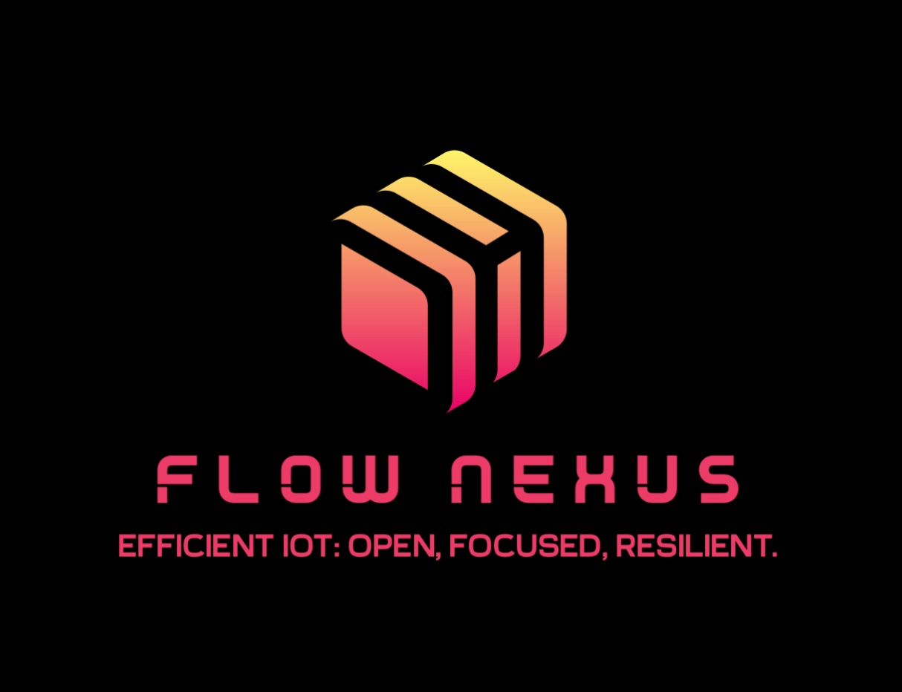

Flow Nexus: Efficient IoT
=========================================

Introduction
------------

Welcome to Flow Nexus, your comprehensive solution for small to medium scale IoT deployments. This platform is designed to streamline the setup, configuration, and use of IoT devices, making it easier than ever to manage your IoT ecosystem.

Motivation
----------

This project aims to provide a minimal and standalone Open Source IoT platform.The focus is on systems with a deployment of up to a few thousand devices, it does not aim to be scalable to millions of devices. The goal is to build a system that recieves e.g. regular temperature samples from remote IoT devices. The temperature samples will be send to a backend and stored in a database. The data is be visualized in a web application.

Vision
------
Our vision for Flow Nexus is to create a user-friendly, efficient, and robust platform for IoT management. We aim to simplify the complexities of IoT deployments, making them accessible and manageable for businesses of all sizes. 

Table of Contents
-----------------
.. toctree::
   :maxdepth: 1

   documentation
   weblog